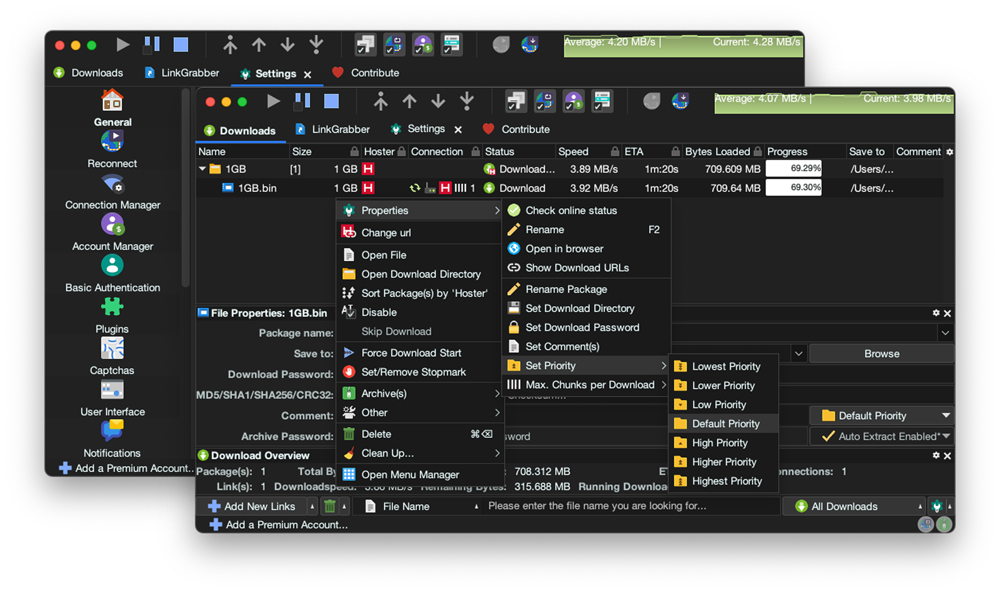

# Material Darker JDownloader



JDownloader 2 dark theme built with
[Material Theme](https://github.com/t3dotgg/vsc-material-but-i-wont-sue-you) Darker Palette,
[FlatLaf](https://github.com/JFormDesigner/FlatLaf) Dark Look and Feel,
[Papirus](https://github.com/PapirusDevelopmentTeam/papirus-icon-theme) Icons,
[Material Design](https://fonts.google.com/icons) Icons,
[Font Awesome](https://fontawesome.com/) Icons, and
[SVG Repo](https://www.svgrepo.com/) Icons.
This theme uses 250+ new icons and has a neutral dark appearance.

## Installation 🛠️

> [!WARNING]
> Installing this theme will change your settings!, do a
> [backup](https://support.jdownloader.org/en/knowledgebase/article/backup-restore-configuration)
> if you want to restore later

### 1. Get the theme files

- Clone this repo or [download the
  zip](https://github.com/moktavizen/material-darker-jdownloader/archive/master.zip)
  file and then extract it
- In your JDownloader, go to `Settings > Settings > Advanced Settings`, search
  for `look and feel theme` and change the value to `FLATLAF_DARK`
- Follow the pop-up instruction to download the theme

### 2. Apply the theme

See Your `<install-dir>` in `Help > About JDownloader > Click me /
Mouse over`, then copy

- `images` folder to `<install-dir>/themes/standard/org/jdownloader`
- `laf` folder to `<install-dir>/cfg`
- `flatlaf.jar` to `<install-dir>/libs/laf`

Choose replace for any conflicts.

### 3. Restart JDownloader or press <kbd>Ctrl</kbd> + <kbd>Shift</kbd> + <kbd>R</kbd>

## FAQ 📑

### Why my font and UI is small? Why the font scale setting doesn't work?

In your `<install-dir>`, create or edit `JDownloader2.vmoptions`
then add

```
-Dsun.java2d.uiScale=200%
```

For Linux, make sure you install JDownloader using the script from
[JDownloader Website](https://jdownloader.org/download/index), `vmoptions`
sometimes is not recognized if you install it using Flatpak, AUR, etc. Proper
HighDPI support is in the works. Check this
[thread](https://board.jdownloader.org/showthread.php?p=532602#post532602) and
[article](https://support.jdownloader.org/en/knowledgebase/article/high-dpi-support)
for more details.

### Why my title bar is white?

Usually, title bar and window decoration style follows your system theme. Enable
`LAFSettings Window Decoration` in Advanced Settings to override the system
theme.
