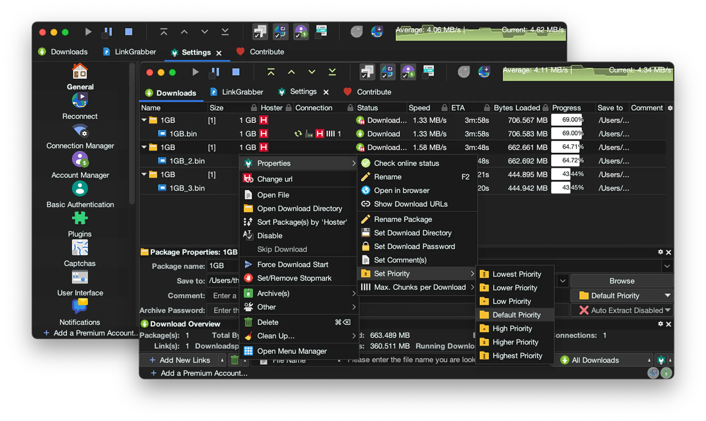

# Material Darker JDownloader



## Installation 🛠️

> [!WARNING]
> This changes your settings! Create a [backup](https://support.jdownloader.org/en/knowledgebase/article/backup-restore-configuration)
> if you plan to restore.

1. [Download the zip](https://github.com/moktavizen/material-darker-jdownloader/releases/download/v25.11/material-darker-jdownloader-2511.zip)
   from the release page and extract it. It should contains `cfg.jd2backup`, `flatlaf.jar`, and `images`

2. Open JDownloader and click on `File > Backup > Restore settings`, continue
   and select `cfg.jd2backup`

3. Follow the pop-up instruction.

4. Open `JD_DIR` by clicking `Help > About JDownloader > Click me / Mouse over`,
   and copy:

   - `flatlaf.jar` to `JD_DIR/libs/laf`
   - `images` to `JD_DIR/themes/standard/org/jdownloader`

   Choose replace or overwrite if prompted.

5. Restart JDownloader.

## FAQ 💬

### How to change the progress bar color?

See https://github.com/moktavizen/material-darker-jdownloader/issues/14#issuecomment-3551113789

### I'm not on Windows, but why my window buttons looks like on Windows?

Disable `Settings > Advanced Settings > Window Decoration`

### Why my font and UI is small? Why the font scale setting doesn't work?

Proper HiDPI support is in the works, see this [article](https://support.jdownloader.org/en/knowledgebase/article/high-dpi-support)
and [thread](https://board.jdownloader.org/showthread.php?p=532602#post532602).
Currently, you can try either:

1. Enable `Settings > Advanced Settings > Font Respects System DPI`

2. Inside `<JD_DIR>` create or edit `JDownloader2.vmoptions` and add

   ```
   -Dsun.java2d.uiScale=200%
   ```

   For Linux, make sure you install JDownloader using the script from
   [JDownloader Website](https://jdownloader.org/jdownloader2#selection=linux),
   `vmoptions` sometimes is not recognized if you install it using Flatpak, AUR,
   etc.

## Acknowledgments 👍

- [Material Theme](https://github.com/t3dotgg/vsc-material-but-i-wont-sue-you)
  for color inspiration.
- [FlatLaf](https://github.com/JFormDesigner/FlatLaf) for Look and Feel theme.
- [Papirus](https://github.com/PapirusDevelopmentTeam/papirus-icon-theme),
  [Material Design](https://fonts.google.com/icons), [Font Awesome](https://fontawesome.com/),
  [SVG Repo](https://www.svgrepo.com/) for icons.
