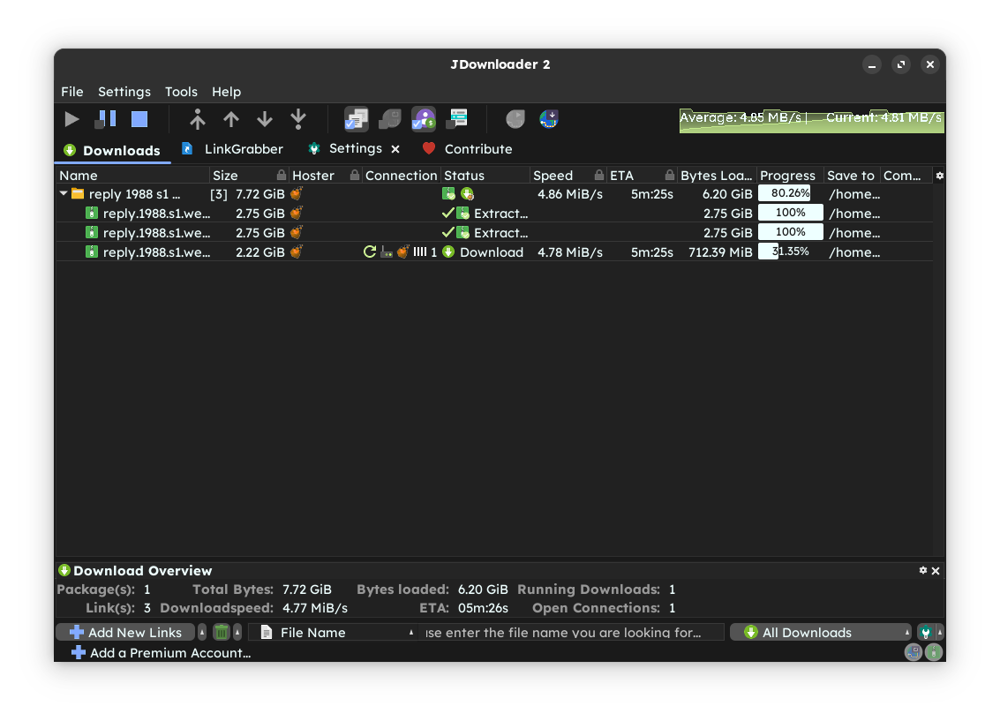
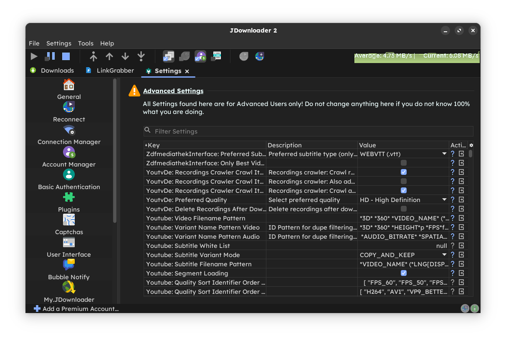

<h1 align="center">Material Theme   JDownloader 2</h1> 

JDownloader 2 Theme built using [Material Theme](https://github.com/material-theme/vsc-material-theme) Palette, [FlatLaf](https://github.com/JFormDesigner/FlatLaf), [Papirus Icon](https://github.com/PapirusDevelopmentTeam/papirus-icon-theme), [Font Awesome](https://fontawesome.com/) Icon, and [SVG Repo](https://www.svgrepo.com/) Icons.

## 🎨 Preview

## ⚙️ Installation

### 1. Clone the repository

run `git clone https://github.com/moktavizen/material-jdownloader.git` 

### 2. Copy the theme files into these directory

- `images` folder to `<installation-directory>/themes/standard/org/jdownloader`

- `laf` folder to `<installation-directory>/cfg`

- `flatlaf.jar` to `<installation-directory>/libs/laf`

> [!NOTE] 
> Choose replace or merge if asked.

See Your `<installation-directory>` in `Help > About Jdownloader > Click me / Mouse over`

### 3. Restart JDownloader or press <kbd>Ctrl</kbd> + <kbd>Shift</kbd> + <kbd>R</kbd>