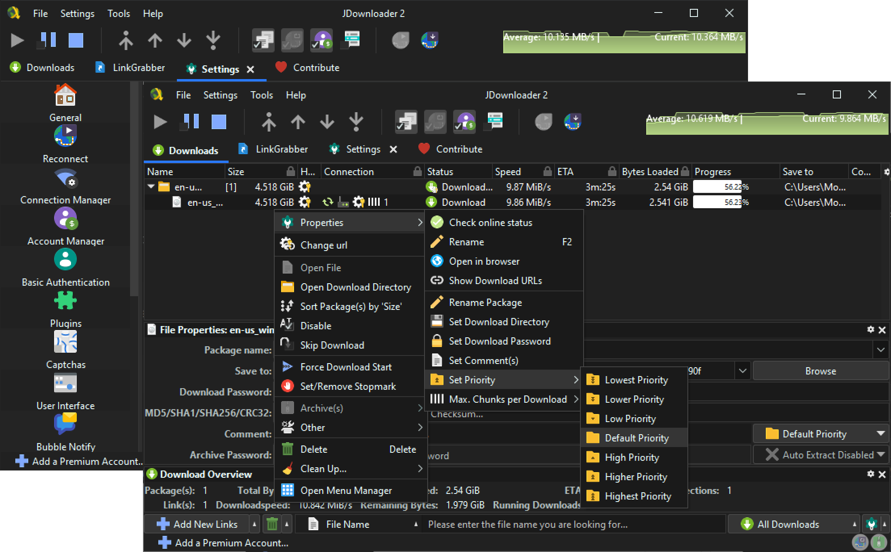

# Material Darker JDownloader

JDownloader 2 dark theme built with [Material
Theme](https://github.com/material-theme/vsc-material-theme) Darker Palette,
[FlatLaf](https://github.com/JFormDesigner/FlatLaf) Dark Look and Feel,
[Papirus](https://github.com/PapirusDevelopmentTeam/papirus-icon-theme) Icons,
[Font Awesome](https://fontawesome.com/) Icons, and [SVG
Repo](https://www.svgrepo.com/) Icons. This theme uses 250+ new icons and has a
neutral dark appearance.

## Installation 🛠️

> [!WARNING]
> Installing this theme will change your settings!, do a
> [backup](https://support.jdownloader.org/en/knowledgebase/article/backup-restore-configuration)
> if you want to restore later

### 1. Get the theme files

- Run `git clone https://github.com/moktavizen/material-jdownloader.git`
- Or [download the
  zip](https://github.com/moktavizen/material-darker-jdownloader/archive/master.zip)
  file of this repository and then extract it
- In your JDownloader, go to `Settings > Settings > Advanced Settings`
- Search for `look and feel theme` and change the value to `FLATLAF_DARK`
- Follow the pop-up instruction to download the theme

### 2. Copy the theme files into these directory

See Your `<installation-directory>` in `Help > About JDownloader > Click me /
Mouse over`, then copy

- `images` folder to `<installation-directory>/themes/standard/org/jdownloader`
- `laf` folder to `<installation-directory>/cfg`
- `flatlaf.jar` to `<installation-directory>/libs/laf`

Choose replace or merge if there are any conflicts

### 3. Restart JDownloader or press <kbd>Ctrl</kbd> + <kbd>Shift</kbd> + <kbd>R</kbd>

## FAQ 📑

### Why my font and UI is small? Why the font scale setting doesn't work?

Check this
[article](https://support.jdownloader.org/en/knowledgebase/article/high-dpi-support)
and [thread](https://board.jdownloader.org/showthread.php?p=532602#post532602)
for detailed instruction. If you want to scale only your JDownloader, Create or
edit `JDownloader2.vmoptions` on your `<installation-directory>`, then add
`-Dsun.java2d.uiScale=200%` inside of it. For Linux, make sure you install
JDownloader using the scipt from [JDownloader
Website](https://jdownloader.org/download/index), `vmoptions` sometimes is not
recognized if you install JDownloader from Flatpak, AUR, etc.

### Why my title bar is white?

Usually, title bar and window decoration follow your system theme. Search for
`LAFSettings Window Decoration` in Advanced Settings and enable it to override
the system theme.
